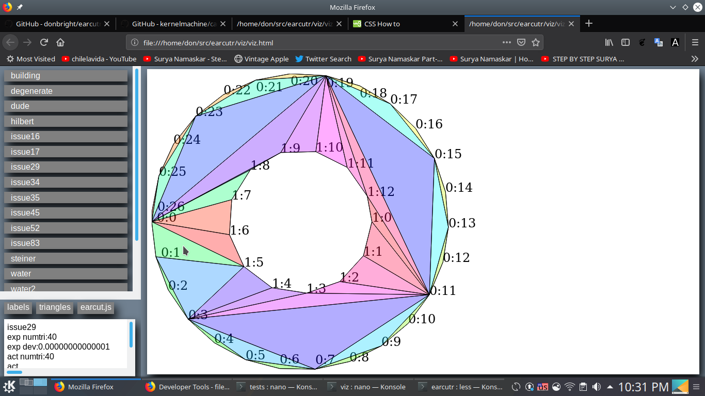

## Earcutr

This is a Polygon triangulation library, translated into Rust computer 
language from the original Earcut project from MapBox. See 
https://github.com/mapbox/earcut and https://www.mapbox.com for more 
information about the original javascript code.



#### Usage

```rust
extern crate earcutr;
var triangles = earcutr::earcut(&vec![10,0, 0,50, 60,60, 70,10],&vec![],2);
println!("{:?}",triangles);  // [1, 0, 3, 3, 2, 1]
```

Signature: 

`earcut(vertices:Vec<f64>, hole_indices:&vec<usize>, dimensions:usize)`.

* `vertices` is a flat array of vertex coordinates like `[x0,y0, x1,y1, x2,y2, ...]`.
* `holes` is an array of hole _indices_ if any
  (e.g. `[5, 8]` for a 12-vertex input would mean one hole with vertices 5&ndash;7 and another with 8&ndash;11).
* `dimensions` is the number of coordinates per vertex in the input array (`2` by default).

Each group of three vertex indices in the resulting array forms a triangle.

```rust
// triangulating a polygon with a hole
earcutr::earcut(&vec![0,0, 100,0, 100,100, 0,100,  20,20, 80,20, 80,80, 20,80], &vec![4],2);
// [3,0,4, 5,4,0, 3,4,7, 5,0,1, 2,3,7, 6,5,1, 2,7,6, 6,1,2]

// triangulating a polygon with 3d coords
earcutr::earcut(&vec![10,0,1, 0,50,2, 60,60,3, 70,10,4], &vec![], 3);
// [1,0,3, 3,2,1]
```

If you pass a single vertex as a hole, Earcut treats it as a Steiner point. 
See the 'steiner' test under tests/fixtures for an example.

If your input is a multi-dimensional array (e.g. [GeoJSON Polygon](http://geojson.org/geojson-spec.html#polygon)),
you can convert it to the format expected by Earcut with `earcut.flatten`:

```rust
let v = vec![vec![vec![0.0,0.0],vec![1.0,0.0],vec![1.0,1.0],vec![0.0,1.0]]];
let holes:Vec<usize> = vec![];
let data = earcutr.flatten( v );
let triangles = earcut(&data.vertices, &data.holes, data.dimensions);
```

After getting a triangulation, you can verify its correctness with 
`earcutr.deviation`:

```rust
let deviation = earcutr.deviation(&data.vertices, &data.holes, data.dimensions, &triangles);
```

Deviation returns the relative difference between the total area of 
triangles and the area of the input polygon. `0` means the triangulation 
is fully correct.

#### How it works: The algorithm

The library implements a modified ear slicing algorithm,
optimized by [z-order curve](http://en.wikipedia.org/wiki/Z-order_curve) hashing
and extended to handle holes, twisted polygons, degeneracies and self-intersections
in a way that doesn't _guarantee_ correctness of triangulation,
but attempts to always produce acceptable results for practical data.

It's based on ideas from
[FIST: Fast Industrial-Strength Triangulation of Polygons](http://www.cosy.sbg.ac.at/~held/projects/triang/triang.html) by Martin Held
and [Triangulation by Ear Clipping](http://www.geometrictools.com/Documentation/TriangulationByEarClipping.pdf) by David Eberly.

#### Visual example

For example a rectangle could be given in GeoJSON format like so:

    [ [ [0,0],[7,0],[7,4],[0,4] ] ]

This has a single contour, or ring, with four points. The way
the points are listed, it looks 'counter-clockwise' or 'anti-clockwise'
on the page. This is the 'winding' and signifies that it is an 'outer'
ring, or 'body' of the shape. 

     _______
     |     |
     |     |
     |     |
     |_____|
 
Now let's add a hole to the square.: 

    [ 
      [ [0,0],[7,0],[7,4],[0,4] ],   
      [ [1,1],[3,1],[3,3] ] 
    ]

This has two contours (rings), the first with four points, the second 
with three points. The second has 'clockwise' winding, signifying it is 
a 'hole'. 

    _______
    |     |
    |  /| |
    | /_| |
    |_____|

After 'flattening', we end up with a single array:

    data [ 0,0,7,0,7,4,0,4,1,1,3,1,3,3  ]
    holeindexes: [ 8 ]
    dimensions: 2

The program will interpret this sequence of data into two separate "rings",
the outside ring and the 'hole'. The rings are stored using a circular
doubly-linked list. 

The program then "removes" the hole, by essentially adding a "cut" between
the hole and the polygon, so that there is only a single "ring" cycle.

         _______
         |     |
         |  /| |
    cut> |_/_| |
         |_____|

Then, an "ear cutting" algorithm is applied, although it is enhanced as
described in the links above.

Data examples are included under tests/fixtures in json files.

#### Tradeoffs

This triangulator is built for simplicity, small size, and as a test to 
see if it could be ported from javascript to Rust.

If you want down-to-the-metal code, there is a C++ port of the 
javascript code, see the link at the end of this README.

If you want to get correct triangulation even on very bad data with lots 
of self-intersections and earcutr is not precise enough, take a look at 
[libtess.js](https://github.com/brendankenny/libtess.js).

You may also want to consider pre-processing the polygon data with 
[Angus J's Clipper](http://angusj.com/delphi/clipper.php) which uses 
Vatti's Algorithm to clean up 'polygon soup' type of data.

#### Coordinate number type

The coordinate type in this code is 64-bit floating point. Note that 
32-bit floating point will fail the tests because the test data files 
have numbers that cannot be held with full precision in 32 bits, like 
the base 10 number 537629.886026485, which gets rounded to 537629.875 
during conversion from base 10 to 32-bit base 2.

#### These algorithms are based on linked lists, is that difficult in Rust?

Yes. [A. Beinges's "Too Many Lists"](https://cglab.ca/~abeinges/blah/too-many-lists/book/) shows how to do Linked Lists in Rust.

This code, instead, implements a Circular Doubly Linked List entirely on 
top of a Rust Vector, so that there is no unsafe code, and no reference 
cycles. This does not use Rc, Box, Arc, etc. The pointers in normal 
Linked List Node code have been replaced by integers which index into a 
single Vector of Nodes. This vector is called 'll' and is created inside
"earcut".

#### Install

You can copy the earcutr.rs file into your own project and use it.

To download the full library, with tests,

```bash
git clone github.com/donbright/earcutr
cd earcutr
cargo test             # generates test output under viz/testoutput
cd viz                 # to visualize results, look under viz
firefox viz.html       # anf view in your favorite web browser (circa 2018)
```

#### Ports to other languages

- [mapbox/earcut](https://github.com/mapbox/earcut) the Original javascript
- [mapbox/earcut.hpp](https://github.com/mapbox/earcut.hpp) C++11

